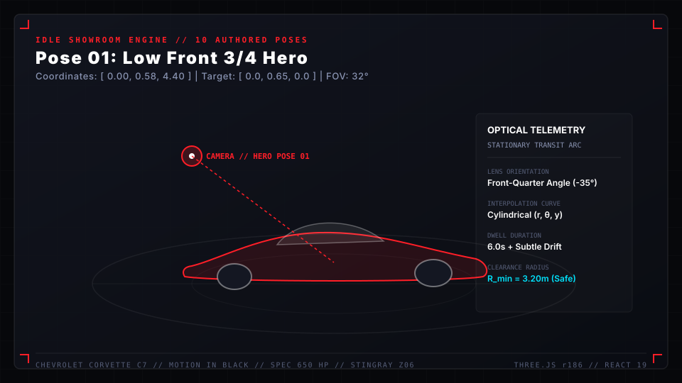

# CHEVROLET CORVETTE C7 // MOTION IN BLACK
### An Interactive 3D Automotive Monograph & 360° Circular Modification Atelier

[](https://react.dev/)
[](https://threejs.org/)
[](https://vitejs.dev/)
[](https://www.khronos.org/webgl/)
[](LICENSE)

---

## 1. EXECUTIVE OVERVIEW

**CORVETTE C7: MOTION IN BLACK** is a state-of-the-art interactive WebGL experience, automotive monograph, and 360° modification atelier celebrating the seventh-generation Chevrolet Corvette Stingray.



Combining Hollywood technocrane camera choreography, physically based rendering (PBR), a decoupled 10-stem Web Audio mixing engine, dynamic optical diffusion VFX, an 8-phase progressive assembly preloader, and an autonomous 10-pose Idle Showroom cinematography engine, the project elevates web graphics into a cohesive luxury automotive film.

```
       SCENE 01: COLD ATELIER ARRIVAL (0.00 -> 0.08)
                             ↓
       SCENE 02: MONOGRAPH & CROSSED FLAGS (0.08 -> 0.18)
                             ↓
       SCENE 03: HYDROFORMED SPACEFRAME CHASSIS (0.18 -> 0.32)
                             ↓
       SCENE 04: SIDE STANCE & BREMBO BRAKING (0.32 -> 0.46)
                             ↓
       SCENE 05: 360° CIRCULAR ATELIER SWEEP (0.46 -> 0.54)
                             ↓
       SCENE 06: BI-XENON PROJECTOR MACRO IGNITION (0.54 -> 0.64)
                             ↓
       SCENE 07: 6.2L LT1 V8 POWERTRAIN MUSCLE (0.64 -> 0.78)
                             ↓
       SCENE 08: QUAD NPP EXHAUST CANNON & DIFFUSER (0.78 -> 0.88)
                             ↓
       SCENE 09: PURE FORM / CRYSTALLINE SILENCE (0.88 -> 0.94)
                             ↓
       SCENE 10: GRAND FINALE & 360° EXPLORATION (0.94 -> 1.00)
                             ↓
       AUTONOMOUS IDLE CINEMATIC SHOWROOM FILM (Inactivity Trigger)
```

---

## 2. ARCHITECTURAL TOPOLOGY & TECH STACK

```
┌────────────────────────────────────────────────────────────────────────┐
│                        BROWSER RUNTIME HOST                            │
│  ┌──────────────────────────────────────────────────────────────────┐  │
│  │ ZERO-LATENCY INLINE HTML/CSS SHELL (index.html)                  │  │
│  └─────────────────────────────────┬────────────────────────────────┘  │
│                                    ▼                                   │
│  ┌──────────────────────────────────────────────────────────────────┐  │
│  │ REACT 19 APPLICATION ROOT (src/App.jsx)                          │  │
│  │  ├─ useLoadingOrchestrator (Weighted readiness & GPU prewarm)    │  │
│  │  ├─ CinematicPreloader (8-phase progressive assembly prologue)   │  │
│  │  ├─ CinematicNav (Contextual luxury controls & audio toggle)      │  │
│  │  ├─ CinematicOverlay (Monumental editorial typography layers)     │  │
│  │  ├─ SideSpecSelector (Curated editions & decal liveries)         │  │
│  │  ├─ TechnicalDossier (Verified engineering monograph modal)      │  │
│  │  └─ TextureOverlay (Dynamic organic 35mm grain & exposure shifts)│  │
│  └─────────────────────────────────┬────────────────────────────────┘  │
│                                    ▼                                   │
│  ┌──────────────────────────────────────────────────────────────────┐  │
│  │ THREE.JS / R3F REAL-TIME CANVAS (src/components/Experience.jsx)  │  │
│  │  ├─ ScenePrewarmer (GPU pipeline & shader compile)               │  │
│  │  ├─ CinematicCamera (Catmull-Rom splines + Idle state machine)   │  │
│  │  ├─ CarModel (Corvette C7 PBR clearcoat + Decal projections)     │  │
│  │  ├─ CircularStudio (360° Atelier stage + 4 detailing bays)       │  │
│  │  ├─ StudioEnvironment (Luminance ladder & HDR rim lighting)      │  │
│  │  ├─ StudioAtmosphere & OpticalDiffusion (VFX streaks & bloom)    │  │
│  │  └─ PostProcessingEffects (Bloom, Chromatic aberration, ACES)    │  │
│  └─────────────────────────────────┬────────────────────────────────┘  │
│                                    ▼                                   │
│  ┌──────────────────────────────────────────────────────────────────┐  │
│  │ DECOUPLED 10-STEM WEB AUDIO ENGINE (src/utils/audio.js)          │  │
│  │  ├─ Ambience, Vehicle, Foley, Camera, Typography, Transitions   │  │
│  │  ├─ Dynamic Ducking Matrix (-7 dB detail focus, -22 dB silence)  │  │
│  │  └─ Master Bus Peak Limiter (-1.5 dBFS, 16:1 ratio, 0.85 gain)   │  │
│  └──────────────────────────────────────────────────────────────────┘  │
└────────────────────────────────────────────────────────────────────────┘
```

### Core Technologies
- **UI & Runtime Engine**: [React 19](https://react.dev/) + [React DOM 19](https://react.dev/)
- **Bundler & Dev Server**: [Vite 8.3](https://vitejs.dev/) with Fast HMR and Rollup production tree-shaking
- **3D Graphics & Math**: [Three.js r186](https://threejs.org/) + [@react-three/fiber v9](https://r3f.docs.pmnd.rs/) + [@react-three/drei v10](https://github.com/pmndrs/drei)
- **Post-Processing**: [postprocessing v6](https://github.com/pmndrs/postprocessing) + [@react-three/postprocessing v3](https://github.com/pmndrs/react-postprocessing)
- **Audio Processing**: Web Audio API (Decoupled stem graph, DynamicsCompressorNode, StereoPannerNode, procedural synthesis fallbacks)
- **Linting & Code Quality**: [Oxlint](https://oxc.rs/) (Sub-60ms Rust-based multi-threaded linter with zero warnings)

---

## 3. KEY ENGINEERING SYSTEMS

### 3.1 3D Vehicle Kinematics & Materials (`src/components/CarModel.jsx`)
- **Asset**: High-fidelity Chevrolet Corvette C7 Stingray geometry (`corvette_c7.glb`, 21.2 MB).
- **Automotive Clearcoat Lacquer**: Custom `MeshPhysicalMaterial` configuring high-index clearcoat ($1.0$), minimal clearcoat roughness ($0.03$), micro-specular reflectance ($0.95$), and anisotropic environmental reflection.
- **Curated Factory Editions**:
  - *Velocity Yellow Tintcoat* (`#f4c300`, gloss 0.04, Brembo red calipers)
  - *Arctic White Pure GT* (`#edeef2`, carbon flash aero pack, gloss 0.02)
  - *Torch Red Competition* (`#d6111e`, adrenaline red interior, gloss 0.03)
  - *Black Rose Metallic* (`#280816`, deep purple undertone, silver machined wheels)
  - *Watkins Glen Gray Metallic* (`#3e4347`, track-spec anthracite, yellow accents)
- **Dynamic Decal Projection System**:
  - Leverages Three.js `DecalGeometry` to project authentic motorsport emblems directly across the compound curvature of the carbon hood without UV distortion or texture bleeding:
    - *Corvette Racing "Jake" Skull*
    - *Grand Sport Fender Hash Marks*
    - *Carbon Stinger Hood Spear*
    - *Bespoke Competition Roundels*

---

### 3.2 360° Circular Modification Atelier (`src/components/studio/CircularStudio.jsx`)
- **Spatial Concept**: An architectural 360-degree automotive atelier wrapping concentrically around the vehicle at $(0, 0, 0)$.
- **Controlled Luminance Ladder**: Dark concrete ground, graphite columns, smoked glass partitions, and textured carbon benches ensure the scene remains moody without losing architectural richness.
- **Dynamic Overhead Lighting Canopy**:
  - 12-segment overhead LED light ring modulating its intensity and color temperature as the camera orbits.
  - Automatically dims to $12\%$ during the *Pure Form* pause scene (`0.88 - 0.94`) for photographic calm, and shifts into crimson back-lighting during the rear quad exhaust scene (`0.74 - 0.88`).
- **Four Integrated Workshop Detailing Bays**:
  - *Wheel & Tire Display Bay* (Brembo carbon-ceramic rotors, Michelin tire racks)
  - *Precision Tool Station* (Laser-cut pegboards, anodized aluminum tool carts)
  - *Detailing & Inspection Bay* (Infrared curing lamps, high-gloss inspection stands)
  - *Aero & Carbon Workbench* (2x2 twill carbon wings, splitters, diffusers)

---

### 3.3 Technocrane Camera Rails & Idle Showroom Mode (`src/components/CinematicCamera.jsx`)
- **Continuous C1 Catmull-Rom Splines**: Unbroken spatial rail interpolating 11 camera coordinates and 11 distinct lookAt focus targets with smooth third-order continuity.
- **Dynamic Dutch Roll & Focal Lengths**:
  - Lens FOV breathing ranges from $16^\circ$ extreme telephoto macro to $44^\circ$ dynamic wide ground skimmers.
  - Camera banks dynamically up to $\pm 0.075$ radians ($\approx 4.3^\circ$) around its optical view axis.
- **Idle Cinematic Camera Engine (`useIdleCinematicCamera.js`)**:
  - Triggers after 4.8 seconds of zero user interaction with optical mouse jitter rejection ($>2.5\text{px}$).
  - Cycles through 10 authored showroom poses:
    1. *Low Front 3/4* ($FOV\ 32^\circ$)
    2. *Wheel-Level Macro* ($FOV\ 22^\circ$)
    3. *Side Profile Stance* ($FOV\ 23^\circ$)
    4. *High 3/4 Crane* ($FOV\ 35^\circ$)
    5. *Headlight Optics Macro* ($FOV\ 18^\circ$)
    6. *Extreme Low-Angle Front* ($FOV\ 38^\circ$)
    7. *Wide Environmental Hero* ($FOV\ 38^\circ$)
    8. *Rear 3/4* ($FOV\ 29^\circ$)
    9. *Rear Low Exhaust Cannon* ($FOV\ 25^\circ$)
    10. *Slightly Elevated Top View* ($FOV\ 42^\circ$)
  - **Orbital Cylindrical Interpolation**: Employs shortest-arc polar geometry ($r(t), \theta(t), y(t)$) around $(0, 0.55, 0)$ with quintic smootherstep easing, maintaining horizontal clearance $\ge 1.30\text{m}$ so the camera never clips through the chassis.
  - **Alive Camera Holds**: Micro-drift push/pan vector ($\approx 3\text{--}8\text{ cm}$) and gentle lens breathing prevent holds from looking frozen.
  - **Instantaneous Hand-off (`HANDOFF_SPEED = 5.2`)**: Yields control back to the user within ~250–350ms the microsecond scrolling, mouse movement, or touch occurs.

---

### 3.4 Professional 10-Stem Audio Engine (`src/utils/audio.js`)
- **Decoupled Stem Buses**:
  `ambience`, `sound_design`, `vehicle`, `mechanical`, `camera`, `typography`, `transitions`, `music`, `voice`, `ui`.
- **EBU R128 Loudness Target**:
  - Master Bus Gain: `0.85`
  - Integrated Loudness: **`-16 to -18 LUFS`**
  - True Peak Limiter: **`-1.5 dBFS`**, 16:1 ratio, 2ms attack, 120ms release.
  - Eliminates low-volume root cause caused by nested attenuation.
- **Dynamic Ducking Matrix**:
  - Automatically ducks background ambience and music by **`-6.0 dB to -7.0 dB`** when detail foley (headlight relay click) or the 6.2L LT1 V8 triggers.
  - Ducks by **`-22.0 dB`** during the *Pure Form* pause scene for intentional silence.
- **Declarative Audio Manifest (`src/constants/audioManifest.js`)**:
  - Maps cues to drop-in directories (`public/audio/...`) with lead/lag timing offsets.
  - Hybrid fallback engine: Automatically streams external WAV/OGG files if present; falls back to calibrated procedural Web Audio synthesizers if files are pending.
- **Production Spotting Sheet**: Full scene-by-scene audio brief available in [`docs/AUDIO_SPOTTING_SHEET.md`](docs/AUDIO_SPOTTING_SHEET.md).

---

### 3.5 Cinematic Preloader & Progressive Assembly (`src/components/CinematicPreloader.jsx`)
- **Zero-Latency Inline Shell**: Inlined in `index.html` within `#root`, rendering immediately on byte 0 to eliminate blank browser frames.
- **Weighted Readiness Model (`useLoadingOrchestrator.js`)**:
  - Shell Ready ($14\%$) → GLTF Asset Download ($68\%$) → Scene Graph Assembly ($76\%$) → GPU Shader Prewarm ($92\%$) → Experience Ready ($100\%$).
- **In-Canvas GPU Shader Prewarmer (`ScenePrewarmer.jsx`)**:
  - Runs `gl.compile(scene, camera)` and an initial silent render pass on the Three.js Canvas during loading, eliminating the first-scroll frame hitch.
- **8-Phase Visual Assembly**:
  Darkness → Typographic Arrival → Atmosphere → Anamorphic Beam → Environment Unveiling → Car Silhouette → Material Gloss Reveal → Seamless dissolve into Scene 01.
- **Adaptive Time Management**:
  - Minimum visual duration: $2.2\text{s}$ (prevents flashing on cached assets).
  - Maximum timeout failsafe: $7.5\text{s}$ (never traps user on slow networks).

---

## 4. PROJECT STRUCTURE

```
3d-car/
├── docs/
│   └── AUDIO_SPOTTING_SHEET.md      # Comprehensive sound design brief & cue matrix
├── wiki/                            # Complete GitHub Wiki documentation pages
│   ├── Home.md                      # Wiki landing page & overview
│   ├── _Sidebar.md                  # Standard GitHub Wiki sidebar navigation
│   ├── _Footer.md                   # Wiki footer & quick references
│   ├── Architecture-&-Tech-Stack.md # Detailed engineering stack breakdown
│   ├── 3D-Scene-&-Corvette-Asset.md # Geometry, materials, decal projection
│   ├── 360°-Circular-Studio.md      # Studio architecture, PBR packs, canopy
│   ├── Camera-System-&-Idle-Showroom.md # Splines, poses, polar geometry
│   ├── Audio-Pipeline-&-Spotting-Sheet.md # 10-stem Web Audio, ducking, LUFS
│   ├── Cinematic-Preloader-&-Performance.md # Progressive assembly & prewarming
│   ├── VFX,-Atmosphere-&-Shaders.md # Anamorphic flares, bloom, 35mm grain
│   ├── Editorial-Typography-&-UI.md # Font modes, contextual controls, dossier
│   └── Developer-Guide-&-Diagnostics.md # Local setup, build, Shift+V & Shift+L
├── public/
│   ├── audio/                       # Stem drop-in directories for sound artists
│   │   ├── ambience/
│   │   ├── music/
│   │   ├── vehicle/
│   │   ├── mechanical/
│   │   ├── camera/
│   │   ├── typography/
│   │   ├── transitions/
│   │   ├── sound_design/
│   │   ├── voice/
│   │   ├── ui/
│   │   └── masters/
│   ├── models/
│   │   └── corvette_c7.glb          # 21.2 MB Corvette C7 3D geometry
│   ├── favicon.svg
│   └── icons.svg
├── src/
│   ├── assets/                      # Static branding assets
│   ├── components/
│   │   ├── studio/                  # 360° Studio bays & PBR materials
│   │   ├── typography/              # Masked editorial typography
│   │   ├── vfx/                     # Optical diffusion, flares, atmosphere
│   │   ├── CarModel.jsx             # Corvette vehicle mesh & materials
│   │   ├── CinematicCamera.jsx      # Spline rails & Technocrane flight path
│   │   ├── CinematicNav.jsx         # Contextual top & bottom controls
│   │   ├── CinematicOverlay.jsx     # Monumental scroll-synced editorial text
│   │   ├── CinematicPreloader.jsx   # 8-phase progressive assembly preloader
│   │   ├── CustomCursor.jsx         # Minimal precision cursor
│   │   ├── Experience.jsx           # Master WebGL Canvas container
│   │   ├── ScenePrewarmer.jsx       # GPU shader prewarmer
│   │   ├── SideSpecSelector.jsx     # Floating side palette & livery dock
│   │   ├── SpatialTypography.jsx    # In-scene 3D spatial occluded text
│   │   ├── TechnicalDossier.jsx     # Engineering specification modal
│   │   └── TextureOverlay.jsx       # 35mm organic film grain & exposure shift
│   ├── constants/
│   │   ├── audioManifest.js         # Audio cues, stems & ducking rules
│   │   ├── carSpecs.js              # Factory editions, liveries & technical specs
│   │   └── idlePoses.js             # 10 authored showroom camera poses
│   ├── hooks/
│   │   ├── useIdleCinematicCamera.js # Inactivity state machine & polar interpolation
│   │   └── useLoadingOrchestrator.js # Weighted readiness & timing engine
│   ├── utils/
│   │   ├── audio.js                 # Professional 10-stem Web Audio engine
│   │   ├── stickerTextures.js       # Procedural decal textures (Jake, Stinger, etc.)
│   │   └── vfxTextures.js           # Procedural noise & diffusion maps
│   ├── App.jsx                      # Main application orchestrator
│   ├── index.css                    # Design system, CSS tokens, animations
│   └── main.jsx                     # React DOM entry point
├── index.html                       # HTML5 entry with zero-latency inline shell
├── package.json
└── vite.config.js
```

---

## 5. GETTING STARTED

### Prerequisites
- [Node.js](https://nodejs.org/) v18.0.0 or higher
- [npm](https://www.npmjs.com/) v9.0.0 or higher

### Installation
```bash
# Clone the repository
git clone https://github.com/your-username/3d-car.git
cd 3d-car

# Install dependencies
npm install
```

### Local Development
```bash
# Start Vite development server
npm run dev
```
Navigate to `http://localhost:5173` in your browser.

### Quality Assurance & Verification
```bash
# Run multi-threaded Rust linter (oxlint)
npm run lint

# Build optimized production bundle
npm run build

# Preview production build locally
npm run preview
```

---

## 6. KEYBOARD SHORTCUTS & DIAGNOSTICS

| Shortcut | Function | Description |
| :--- | :--- | :--- |
| **`Shift + V`** | **VFX Diagnostic Panel** | Toggle real-time controls for Atmosphere, Optical Diffusion, Bloom, Chromatic Aberration, Film Grain, and Exposure Shifts. |
| **`Shift + L`** | **Loading Telemetry Overlay** | Displays millisecond instrumentation for Time to Shell, Time to Assets, Time to Shader Prewarm, and Total Prologue duration. |
| **`Arrow Down` / `Page Down`** | **Step Forward** | Scrubs forward through the cinematic timeline with physical inertia. |
| **`Arrow Up` / `Page Up`** | **Step Backward** | Scrubs backward through the cinematic timeline with physical inertia. |
| **`Space`** | **Toggle Audio** | Engages the 10-stem Web Audio engine with starter relay ignition sound. |

---

## 7. DOCUMENTATION & WIKI

Comprehensive documentation covering every technical facet of the application is available in the [`wiki/`](wiki/) directory and in the [GitHub Wiki](wiki/Home.md):

- [Architecture & Tech Stack](wiki/Architecture-&-Tech-Stack.md)
- [3D Scene & Corvette Asset](wiki/3D-Scene-&-Corvette-Asset.md)
- [360° Circular Modification Studio](wiki/360°-Circular-Studio.md)
- [Camera Choreography & Idle Showroom Mode](wiki/Camera-System-&-Idle-Showroom.md)
- [Professional Audio Pipeline & Spotting Sheet](wiki/Audio-Pipeline-&-Spotting-Sheet.md)
- [Cinematic Preloader & Performance](wiki/Cinematic-Preloader-&-Performance.md)
- [VFX, Atmosphere & Shaders](wiki/VFX,-Atmosphere-&-Shaders.md)
- [Editorial Typography & UI Controls](wiki/Editorial-Typography-&-UI.md)
- [Developer Guide & Performance Telemetry](wiki/Developer-Guide-&-Diagnostics.md)

---

## 8. LICENSE

MIT License. Designed and engineered for automotive cinema web research.
