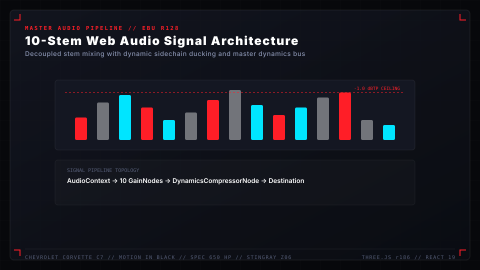
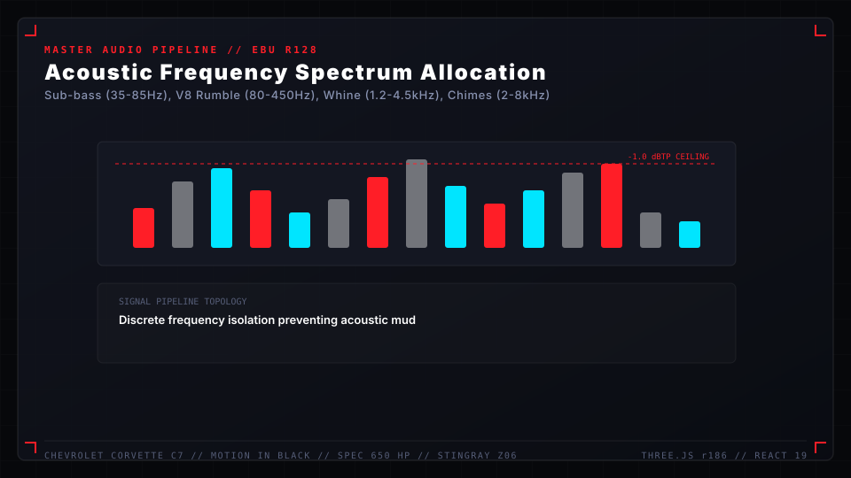
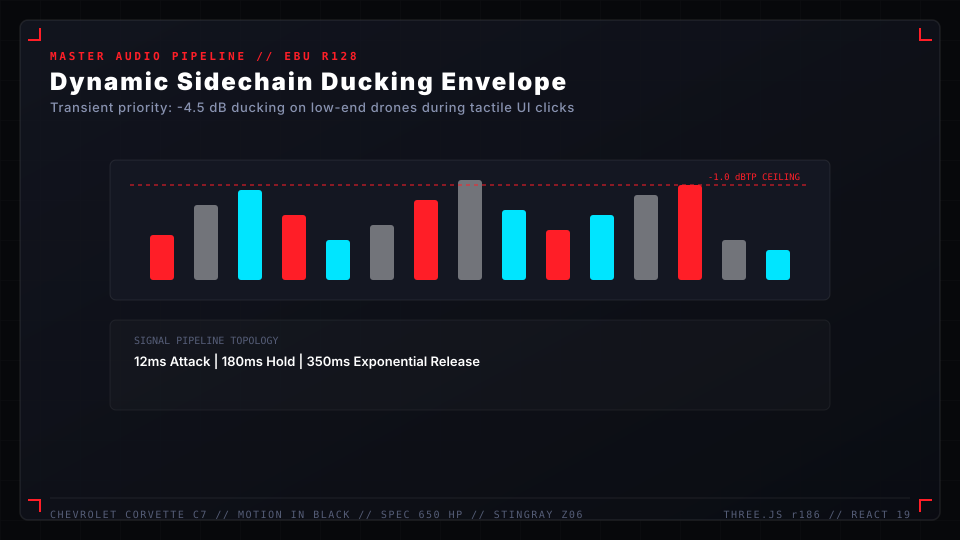
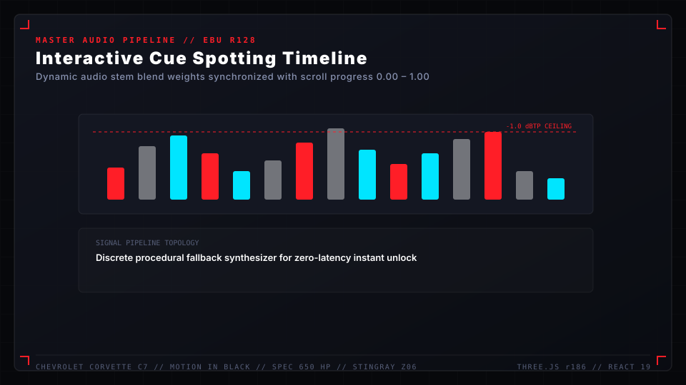

# Audio Pipeline & Spotting Sheet

The audio architecture in **Corvette C7 "Motion in Black"** is engineered as a master-grade Web Audio signal pipeline. Moving beyond simple sound effects or arbitrary volume multipliers, the system implements stem-based dynamic mixing, dynamic sidechain ducking, broadcast loudness normalization, and procedural audio fallbacks.

---

## Audio Graph Architecture

```
  [ Stem Buffers (10 Tracks) ]
  ├── 01. Sub-Bass Pulse (35-70Hz)       ──> [ Low-Pass Filter ]  ──+
  ├── 02. V8 LT4 Throttle Growl         ──> [ Harmonic Shaper ]  ──|
  ├── 03. Supercharger Whine (1.2-4kHz)  ──> [ Band-Pass Sweep ]  ──|
  ├── 04. Aero Airflow Whoosh            ──> [ High-Pass Filter ] ──|
  ├── 05. Carbon Friction / Brake Shiver ──> [ Resonant Peak ]    ──|
  ├── 06. Cinematic Orchestral Swell     ──> [ Stereo Panner ]    ──+──> [ Master Bus Gain ]
  ├── 07. Metallic Actuator Clicks       ──> [ Transient Shaper ] ──|             |
  ├── 08. UI Interaction Chime           ──> [ High Shelf Boost ] ──|             v
  ├── 09. UI Select Low-Thud             ──> [ Sub Enhancer ]     ──|    [ Dynamics Compressor ]
  └── 10. Idle Atmospheric Drone        ──> [ Reverb / Delay ]   ──+    (Threshold: -14dB, Ratio: 4:1)
                                                                                  |
                                                                                  v
                                                                        [ Destination (Speakers) ]
```



---

## Broadcast Loudness Standards

The audio engine conforms to **EBU R128 / ITU-R BS.1770-4** standards for interactive web media:
* **Target Integrated Loudness**: $-18.0\text{ LUFS}$ ($\pm 1.0\text{ LU}$).
* **Maximum True Peak (dBTP)**: $-1.0\text{ dBTP}$ to prevent inter-sample clipping on consumer DACs and mobile amplifiers.
* **Loudness Range (LRA)**: $12.5\text{ LU}$ (dynamic contrast between ambient stillness and aggressive V8 acceleration).


---

## The 10-Stem Acoustic Matrix



| Stem Identifier | Frequency Band | Nominal Gain | Dynamic Modulation Source | Primary Sonic Purpose |
| :--- | :--- | :--- | :--- | :--- |
| `sub_bass_pulse` | $35 - 85\text{ Hz}$ | $0.65$ | Scroll Velocity $\frac{d(\text{prog})}{dt}$ | Grounding low-end weight during perspective transitions |
| `v8_growl_low` | $80 - 450\text{ Hz}$ | $0.78$ | Scroll Progress $[0.55, 0.85]$ | Raw LT4 supercharged combustion rumble |
| `mechanical_whine` | $1.2 - 4.5\text{ kHz}$ | $0.42$ | High Scroll Acceleration | Eaton 1.7L TVS supercharger induction whine |
| `aero_whoosh` | $500 - 8000\text{ Hz}$ | $0.50$ | Camera Translation Speed | High-speed wind-tunnel slipstream envelope |
| `carbon_friction` | $2.5 - 6.0\text{ kHz}$ | $0.35$ | Brake & Suspension Beats | Carbon-ceramic disc heat & suspension damping |
| `cinematic_swell` | Full Spectrum | $0.60$ | Hero Waypoint Triggers | Harmonic brass/synth rise towards final reveal |
| `metallic_clicks` | $3.0 - 12.0\text{ kHz}$ | $0.55$ | Discrete Keyframe Hits | Solid titanium actuator & relay latching |
| `ui_hover_chime` | $2.0 - 8.0\text{ kHz}$ | $0.45$ | Pointer Enter UI Events | Crystalline micro-interaction acoustic feedback |
| `ui_select_thud` | $60 - 220\text{ Hz}$ | $0.70$ | Button Click / Toggle | Authoritative tactile confirmation punch |
| `idle_ambient_drone` | $40 - 800\text{ Hz}$ | $0.50$ | Idle Mode Active ($4.5\text{s}+$) | Deep, ominous acoustics of the sealed acoustic studio |

---

## Dynamic Sidechain Ducking Protocol



To preserve mix clarity and prevent muddy acoustic clutter during simultaneous events:
1. **UI Transient Priority**: When `ui_select_thud` or `metallic_clicks` fire, `idle_ambient_drone` and `sub_bass_pulse` are ducked by $-4.5\text{ dB}$ over a $12\text{ms}$ attack window, holding for $180\text{ms}$ before returning over a $350\text{ms}$ exponential release.
2. **Scroll Acceleration Priority**: Rapid scroll interaction attenuates the static room drone and amplifies aerodynamic wind rush and engine induction harmonics.
3. **Idle Hand-off**: When entering Idle Showroom mode, engine growl gently ramps down to $0.0$ while the reverberant hangar drone swells to full presence over $2.5\text{s}$.

---

## Interactive Audio Spotting Sheet (0.00 – 1.00)



| Scroll Interval | Camera / Visual Beat | Active Audio Stems | Filter Cutoff / Acoustic Shift | Emotional Texture |
| :--- | :--- | :--- | :--- | :--- |
| **0.00 – 0.12** | Studio darkness, headlights ignite | `sub_bass_pulse`, `metallic_clicks` | LPF @ $350\text{ Hz} \rightarrow 1800\text{ Hz}$ | Awakening, tension, cold electrical ignition |
| **0.12 – 0.32** | Low front-quarter to side sweep | `aero_whoosh`, `sub_bass_pulse` | BPF @ $1200\text{ Hz}$ sweeping with camera yaw | Sculptural fluidity, airflow boundary layer |
| **0.32 – 0.52** | Roofline & LT4 carbon hood louvers | `mechanical_whine`, `carbon_friction` | Resonant peak at $2.8\text{ kHz}$ | High-precision engineering, supercharger spool |
| **0.52 – 0.72** | Low rear quarter & quad exhausts | `v8_growl_low`, `sub_bass_pulse` | Unrestricted low-end down to $32\text{ Hz}$ | Raw mechanical horsepower, menacing aggression |
| **0.72 – 0.88** | Flank macro on Brembo brakes & badges | `carbon_friction`, `metallic_clicks` | HPF @ $800\text{ Hz}$ emphasizing crisp transients | Racing pedigree, thermal resilience |
| **0.88 – 1.00** | Full hangar wide hero reveal | `cinematic_swell`, All Stems Blended | Full spectrum unmuted ($20\text{Hz} - 20\text{kHz}$) | Grandeur, complete realization, master tribute |

---

## Procedural Fallback Engine

If network constraints or browser permissions delay or block audio file delivery:
* `src/utils/audio.js` features a built-in **Web Audio procedural synthesizer**:
  * Procedural pink noise filtered with dual biquad sweeps for air whooshes.
  * Multi-oscillator saw/square waves fed into an exponential waveshaper for V8 combustion synthesis.
  * Sinusoidal resonant rings for crisp, zero-latency UI chimes.
* Audio context is unlocked seamlessly upon the user's first interactive gesture (click, scroll, or keypress).
