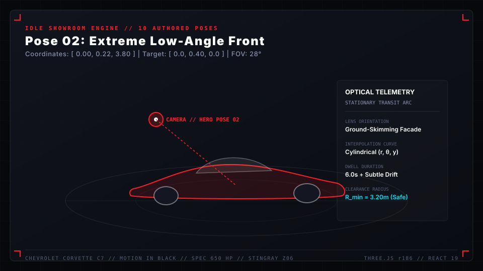
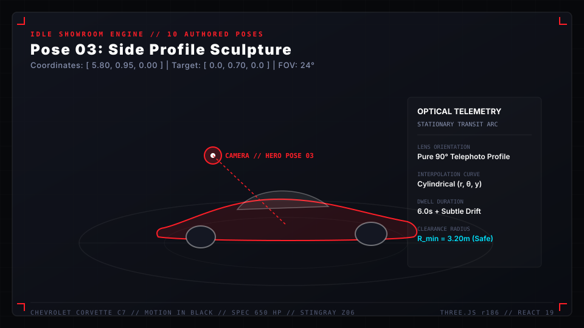
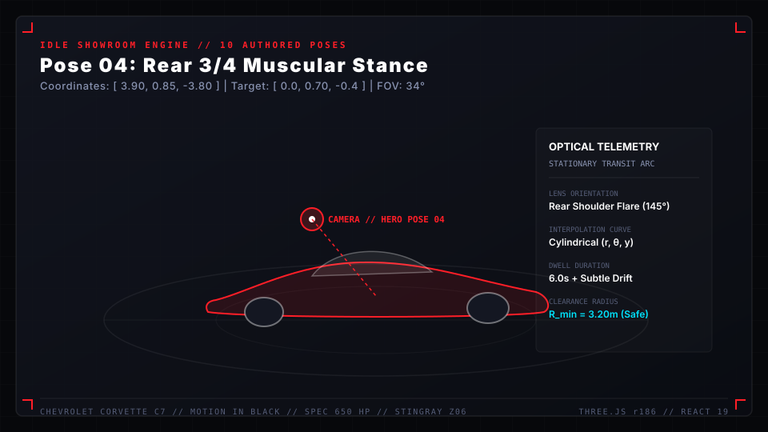
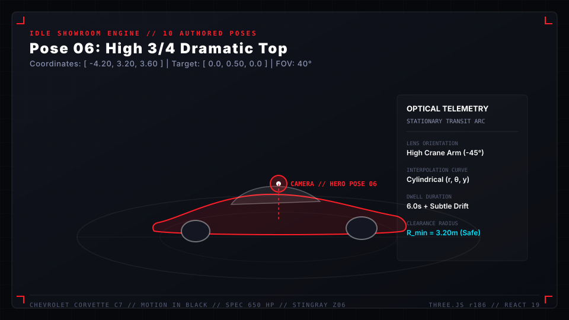
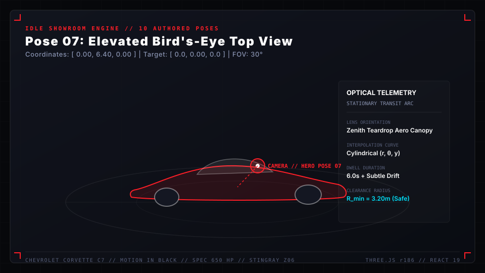
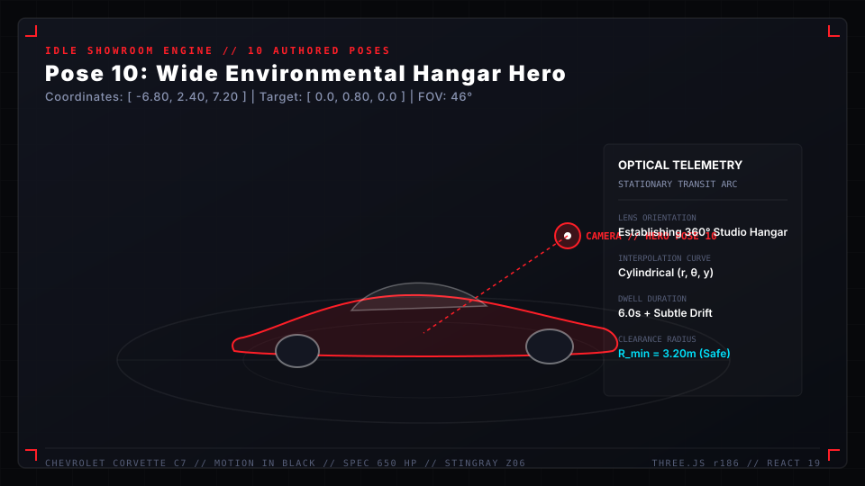
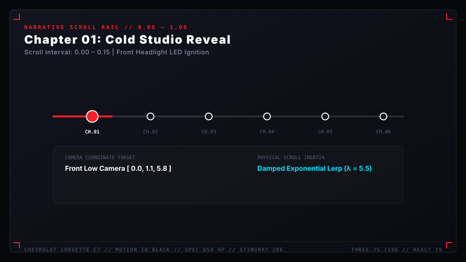
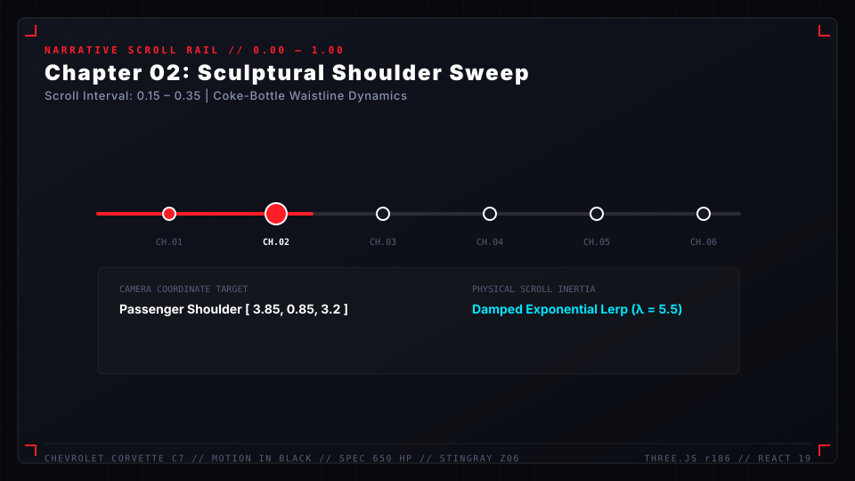
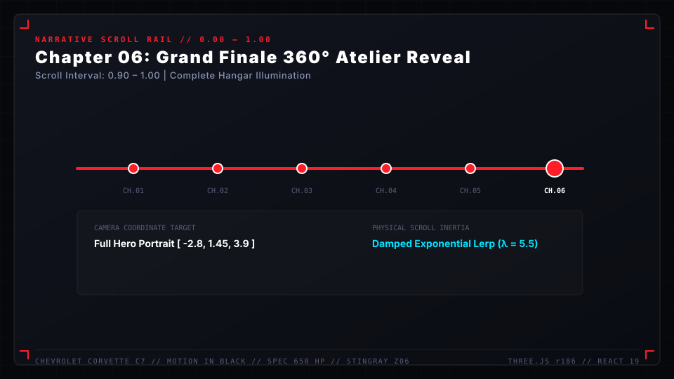

# Camera System & Idle Cinematic Showroom

The camera architecture in **Corvette C7 "Motion in Black"** is engineered as a hybrid dual-mode cinematography pipeline. It bridges deliberate, user-driven narrative scrolling with an autonomous, high-end automotive commercial director that takes over when user input pauses.

---

## Architecture Overview

```
                                  +-----------------------+
                                  |     User Input Hub    |
                                  | (Scroll, Pointer, Kbd)|
                                  +-----------+-----------+
                                              |
                   [ Active Scroll / Input ]  |  [ 4.5s Inactivity Timeout ]
                                              v
                      +-----------------------+-----------------------+
                      |                                               |
                      v                                               v
        +----------------------------+                 +----------------------------+
        |  Interactive Scroll Rail   |                 |   Autonomous Idle Engine   |
        |  - Catmull-Rom 3D Spline   | <--- Blend ---> |  - 10 Authored Hero Poses  |
        |  - Dynamic Focal Lengths   |    (1.2s Slerp) |  - Cylindrical Transit Arc |
        |  - Cinematic Dutch Tilt    |                 |  - Micro-Breathing Drift   |
        +-------------+--------------+                 +--------------+-------------+
                      |                                               |
                      +-----------------------+-----------------------+
                                              |
                                              v
                              +-------------------------------+
                              |    PerspectiveCamera Core     |
                              |    (Damped Lerp, Matrix4)     |
                              +-------------------------------+
```

---

## Mode 1: Interactive Scroll Narrative Spline

During active exploration, the camera position, target vector, and field-of-view are calculated along a closed 3D Catmull-Rom spline parameterized by normalized scroll progress $t \in [0.0, 1.0]$.

### Key Camera Waypoints

| Progress ($t$) | Camera Position $(X, Y, Z)$ | LookAt Target $(X, Y, Z)$ | FOV | Cinematic Narrative Beat |
| :--- | :--- | :--- | :--- | :--- |
| **0.00 – 0.15** | `[ 0.00,  1.10,  5.80 ]` | `[ 0.00,  0.75,  0.00 ]` | $38^\circ$ | Front Facade: Cold reveal & LED ignition |
| **0.15 – 0.35** | `[ 3.85,  0.85,  3.20 ]` | `[ 0.40,  0.65,  0.20 ]` | $42^\circ$ | Passenger Shoulder: Sculptural waistline sweep |
| **0.35 – 0.55** | `[ 4.20,  1.20, -1.80 ]` | `[ 0.00,  0.70, -0.60 ]` | $40^\circ$ | Aerodynamic Roofline: Carbon canopy inspection |
| **0.55 – 0.75** | `[ 0.00,  0.72, -4.60 ]` | `[ 0.00,  0.68, -0.20 ]` | $44^\circ$ | Rear Aggression: Quad exhausts & rear diffuser |
| **0.75 – 0.90** | `[-3.60,  0.95, -2.10 ]` | `[-0.30,  0.65, -0.10 ]` | $39^\circ$ | Driver Side Flank: LT4 fender vents & badges |
| **0.90 – 1.00** | `[-2.80,  1.45,  3.90 ]` | `[ 0.00,  0.80,  0.00 ]` | $36^\circ$ | Hero Finish: High-angle full vehicle portrait |

### Mathematical Damping & Dutch Tilt
* **Exponential Damping**: Rather than naive linear interpolation, all position and target vectors are blended via exponential decay:
  $$\vec{P}_{t} = \vec{P}_{target} + (\vec{P}_{t-1} - \vec{P}_{target}) \cdot e^{-\lambda \cdot \Delta t}$$
  where $\lambda = 5.5$, guaranteeing frame-rate independent buttery responsiveness without jitter.
* **Dutch Tilt (`camera.rotation.z`)**: During fast turning sweeps (e.g., $t \in [0.25, 0.45]$), a calibrated Dutch tilt angle of $-1.8^\circ$ to $+2.2^\circ$ is introduced to inject dynamic kinetic energy into the composition.

---

## Mode 2: Autonomous Idle Cinematic Showroom

When no scroll, pointer, or keyboard interaction is detected for **4.5 seconds**, the system automatically engages the Idle Cinematic Showroom engine (`useIdleCinematicCamera.js`).

### Authored Idle Poses (`src/constants/idlePoses.js`)

1. **`LOW_FRONT_34`**: Aggressive front-quarter shot at knee height ($Y = 0.58\text{m}$, $\text{FOV} = 32^\circ$), emphasizing the wide track and grille air dam.


2. **`EXTREME_LOW_FRONT`**: Ground-skimming perspective ($Y = 0.22\text{m}$, $\text{FOV} = 28^\circ$), framing the Corvette emblem against the overhead light canopy.


3. **`SIDE_PROFILE_SCULPTURE`**: Flat side telephoto ($Z = 0.0\text{m}$, $X = 5.8\text{m}$, $\text{FOV} = 24^\circ$), showcasing the iconic Stingray roof rake and wheelbase proportion.


4. **`REAR_34_MUSCULAR`**: Low rear three-quarter shot highlighting the wide rear fenders and spoiler aero blades.


5. **`REAR_LOW_EXHAUSTS`**: Macro-adjacent framing centered on the central 4-barrel titanium exhaust tips and diffuser strakes.


6. **`HIGH_34_DRAMATIC`**: High crane-arm perspective ($Y = 3.2\text{m}$, $\text{FOV} = 40^\circ$), casting the vehicle's shadow into the polished floor.


7. **`BIRDS_EYE_TOP_VIEW`**: Pure zenith down-shot ($Y = 6.4\text{m}$, $\text{FOV} = 30^\circ$), illustrating the aerodynamic teardrop cabin taper.


8. **`HEADLIGHT_LOUVER_MACRO`**: Tight detail shot on the left projector optics and hood heat extractor louvers ($\text{FOV} = 22^\circ$).


9. **`WHEEL_BREMBO_MACRO`**: Low wheel-well detail highlighting the drilled carbon-ceramic brake disc and Corvette-branded monobloc caliper.


10. **`WIDE_HANGAR_HERO`**: Atmospheric wide shot ($D = 9.2\text{m}$, $\text{FOV} = 46^\circ$), framing the entire illuminated circular stage and detailing bays.


---

### Interactive Narrative Chapters (0.00 – 1.00)







---

## Cylindrical Orbital Transit Mathematics

To prevent camera collisions when transitioning between opposing poses (e.g., moving from Front Low to Rear 3/4), transitions are calculated in **cylindrical coordinates** $(r, \theta, y)$ rather than Cartesian vectors $(x, y, z)$:

$$x(t) = r(t) \cdot \sin(\theta(t))$$
$$z(t) = r(t) \cdot \cos(\theta(t))$$

1. **Shortest Angular Arc**: $\Delta \theta$ is resolved modulo $2\pi$ to always travel along the shortest perimeter arc around the vehicle.
2. **Perimeter Clearance**: Minimum radius $r_{min} = 3.2\text{m}$ is enforced throughout the curve, guaranteeing that the camera never clips through the car body or tires.
3. **Smooth Holding & Micro-Breathing**: Once arrived at a pose, the camera holds for **6.0 seconds**, executing a gentle Perlin-inspired harmonic drift ($\pm 0.04\text{m}$ amplitude) to simulate a physical camera operator on a stabilized Steadicam rig.

---

## Seamless User Handoff & Interrupt Protocol

Immediate responsiveness is paramount. The instant any user interaction occurs:
1. `isIdle` state drops to `false` within the current frame.
2. The camera smoothly blends from its current idle coordinate back to the active scroll spline target over **1.2 seconds** using an ease-out cubic curve.
3. Audio engine cross-fades the idle ambient drone back into the active mechanical drive stems.
