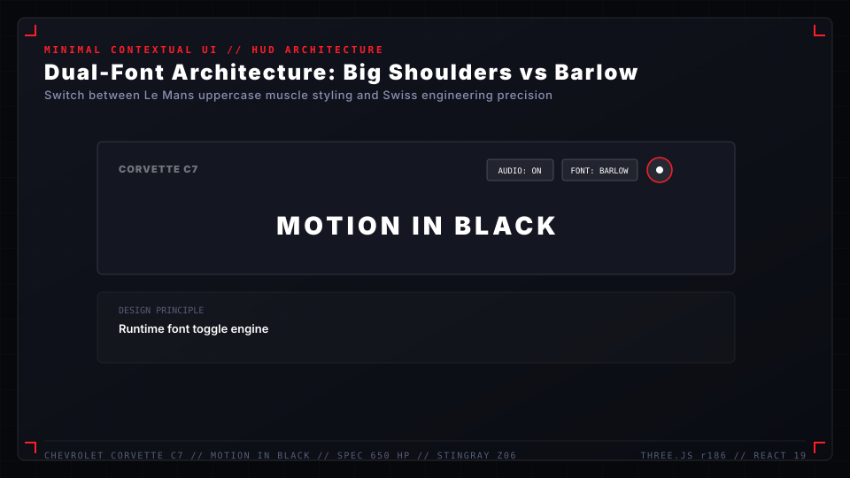
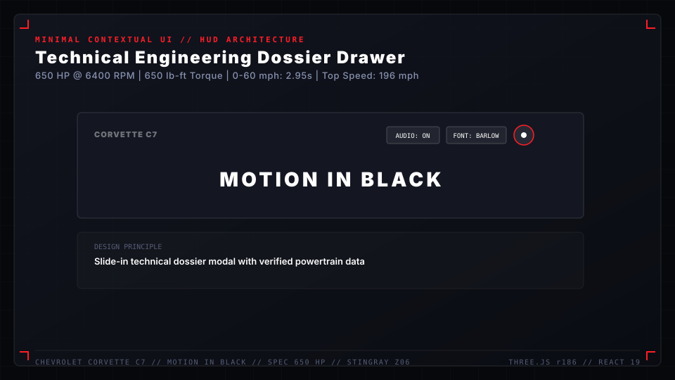
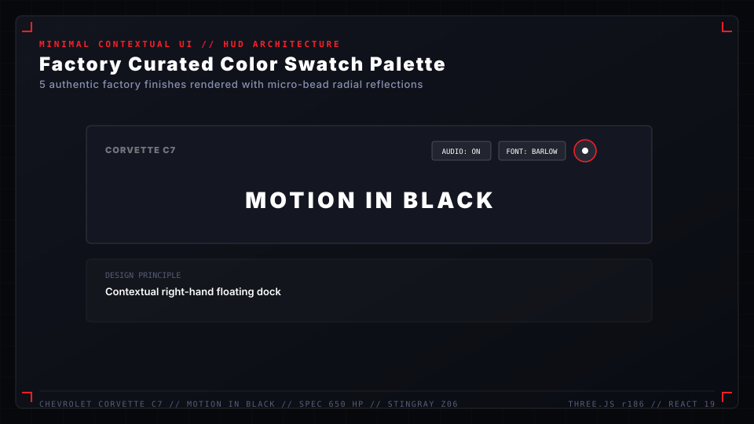
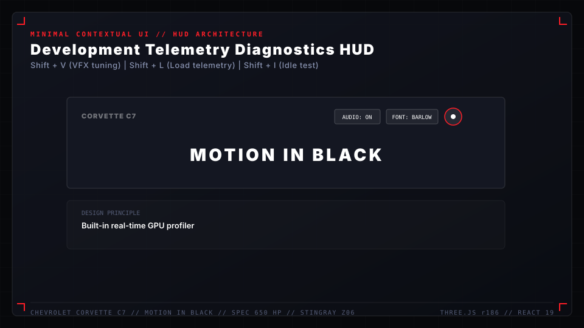

# Editorial Typography & Contextual UI

The UI architecture in **Corvette C7 "Motion in Black"** merges Swiss modernist editorial precision with aerospace telemetry aesthetics. Following a major design cleanup pass, all persistent intrusive cards and modal clutter were eliminated in favor of a **lightweight, contextual floating HUD** that lets the 3D vehicle dominate the viewport.

---

## Typography Hierarchy & Dual Font Engine

The experience provides a dynamic **Dual Font Architecture**, allowing instant switching between high-impact automotive display styling and technical Swiss modernist engineering:

```
+-----------------------------------------------------------------------------+
| FONT OPTION A: "BIG SHOULDERS DISPLAY"                                      |
| Condensed, ultra-bold, architectural uppercase. Evokes American muscle car   |
| horsepower, track billboards, and Le Mans paddock branding.                 |
+-----------------------------------------------------------------------------+
| FONT OPTION B: "BARLOW / BARLOW CONDENSED"                                  |
| Precise, functional, grostesque sans-serif. Evokes CAD drawings, wind tunnel |
| engineering documents, and European endurance racing manuals.                |
+-----------------------------------------------------------------------------+
```

### Typeface Roles

| Level | Font Family | Weight / Tracking | Case | Applied Usage |
| :--- | :--- | :--- | :--- | :--- |
| **Headline Display** | Big Shoulders / Barlow Semi Condensed | $900$ (Black) / $+0.08\text{em}$ | Uppercase | Chapter titles (`MOTION IN BLACK`, `LT4 SUPERCHARGED`) |
| **Section Subheaders** | Barlow Condensed | $600$ (SemiBold) / $+0.12\text{em}$ | Uppercase | Technical classification tags & phase indicators |
| **Body Narrative** | Inter / Barlow | $400$ (Regular) / Normal | Sentence | Vehicle history, aerodynamic analysis paragraphs |
| **Telemetry HUD** | JetBrains Mono / Space Mono | $500$ (Medium) / $+0.04\text{em}$ | Tabular figures | RPM, G-meter, Boost (PSI), Camera $(X,Y,Z)$, Timecode |



---

## Minimalist Contextual HUD Layout


```
  +-------------------------------------------------------------------------+
  | [ CORVETTE C7 ]                                  [ AUDIO: ON ] [ FONT ] |
  |   STINGRAY Z06                                                          |
  |                                                                         |
  |                                                                         |
  |                            [ 3D STAGE ]                                 |
  |                                                                         |
  |                                                                         |
  | [ SPEC DOSSIER ]                                                        |
  |   (Collapsible)                              [ COLOR EDITION SELECTOR ] |
  |   650 HP | 650 LB-FT                         [01] [02] [03] [04] [05]   |
  +-------------------------------------------------------------------------+
```

### 1. Header Bar
* **Left**: Minimalist brandmark and model designation in low-opacity brushed white.
* **Right**: Quick-action toggles:
  * Audio mute / unmute button with live animated waveform bars.
  * Font system switcher (`Big Shoulders` $\leftrightarrow$ `Barlow`).
  * Circular GitHub repository link button with touch/hover opacity boost.

### 2. Vehicle Specification Dossier (Left Drawer)

* Non-persistent, discreetly collapsed by default.
* Clicking or hovering expands an engineered specification drawer:
  * **Engine**: $6.2\text{L}$ Supercharged LT4 V8 with Eaton 1.7L TVS.
  * **Output**: $650\text{ HP} @ 6400\text{ RPM}$ / $650\text{ lb-ft} @ 3600\text{ RPM}$.
  * **Acceleration**: $0 - 60\text{ mph in } 2.95\text{ seconds}$.
  * **Lateral Acceleration**: $1.20\text{ g}$ maximum skidpad grip.
  * **Dry Weight**: $1,598\text{ kg}$ ($3,524\text{ lbs}$).

### 3. Factory Edition Color Selector (Bottom Right)

* Offers 5 authentic factory-calibrated exterior paint finishes:
  1. **Carbon Flash Metallic**: Deep obsidian black with micro-metallic gold/violet pearl.
  2. **Torch Red Racing**: High-saturation racing scarlet with crystal-clear resin topcoat.
  3. **Watkins Glen Gray**: Industrial matte-adjacent metallic charcoal with high anisotropic sheen.
  4. **Arctic White Track**: High-contrast crisp white with black carbon aero accents.
  5. **Laguna Blue Tintcoat**: Deep cerulean metallic with cyan highlights under canopy spot arrays.

### 4. Telemetry Diagnostics HUD (`Shift + V`, `Shift + L`)


---

## Magnetic Micro-Interaction Architecture

To create a physical, premium feel without playful bouncing:
* **Target Elements**: Primary navigation buttons, color swatches, and audio toggles.
* **Physics Model**:
  * Restrained travel: Maximum displacement capped strictly at $4\text{px} - 8\text{px}$.
  * Critical damping factor ($\zeta = 1.0$): Zero oscillation, zero bounce, smooth asymptotic return to origin on pointer leave.
* **Mobile / Touch Fallback**:
  * Automatically disabled on devices matching `(pointer: coarse)` or touch screens to prevent sticky hover states and scroll interruptions.
